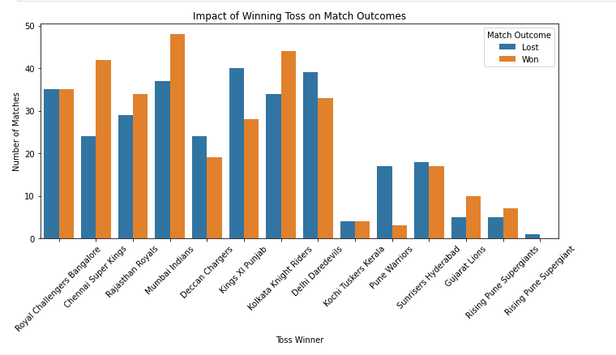
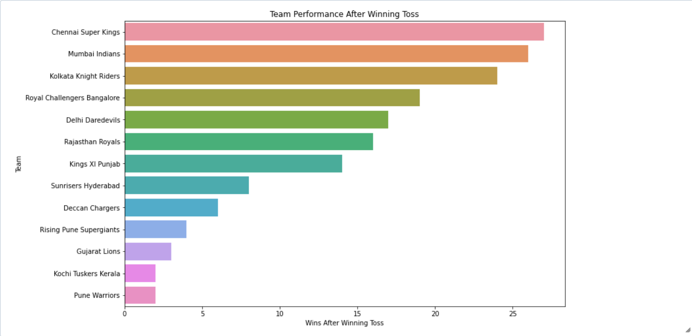
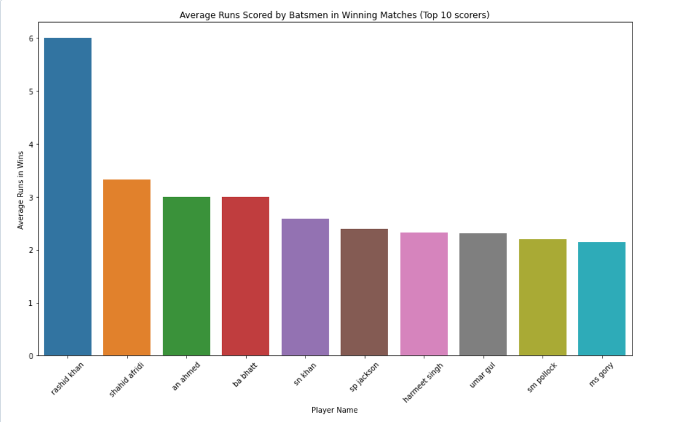
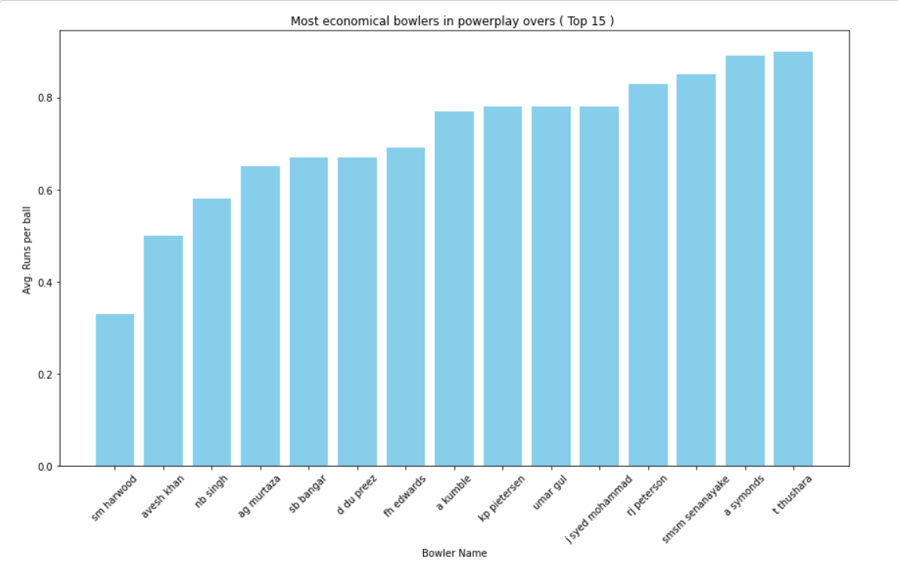
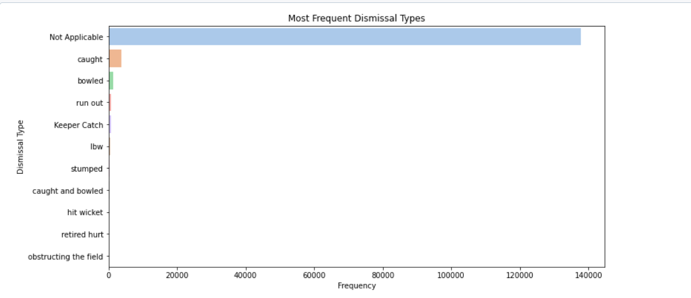
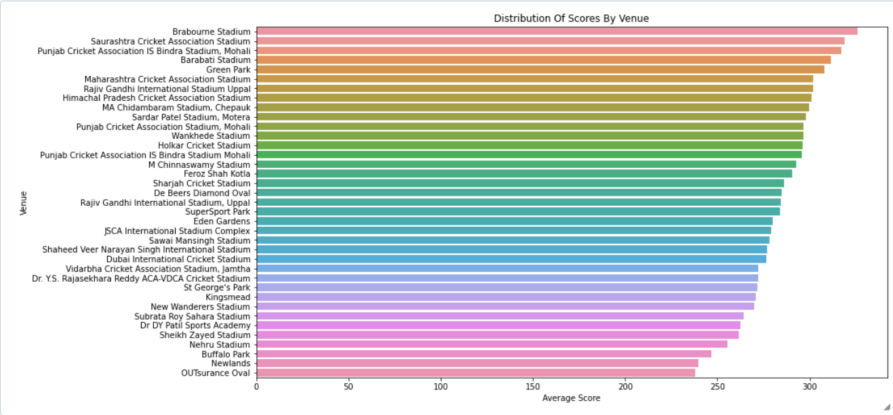

# IPL Data Analysis Project

## Introduction

This project focuses on the analysis of IPL (Indian Premier League) data. The data used in this analysis is openly available from [cricsheet.org](http://cricsheet.org/) and [data.world](https://data.world/raghu543/ipl-data-till-2017). The analysis aims to derive meaningful insights from the data through thorough cleaning and various analytical techniques.

## Data Sources

- **CricSheet**: Provides ball-by-ball data for IPL matches.
- **data.world**: Hosts comprehensive datasets related to IPL matches till 2017.

## Tools and Technologies

- **Databricks Community Edition**: Utilized for compute resources and Spark environment.
- **Apache Spark**: Used for data processing and SQL queries.
- **Python**: Used for data manipulation and analysis.
- **Pandas**: For handling and cleaning data in DataFrames.
- **Matplotlib & Seaborn**: For data visualization.

## Analysis Performed

1. **Data Cleaning**: Ensured that the data was clean and ready for analysis by handling missing values and removing duplicates.
2. **Toss Win Analysis**: Calculated the percentage of matches won by teams that also won the toss.
3. **Data Visualization**: Created various graphs to visualize the data and infer insights.
4. **Detailed Findings**:
   - **Top Scoring Batsmen per Season**: Identified the top-scoring batsmen for each IPL season.
   - **Economical Bowlers in Powerplay**: Analyzed bowlers with the best economy rates during powerplay overs.
   - **Impact of Winning Toss on Match Outcome**: Investigated how winning the toss influences the match outcome.
   - **Toss Win and Match Win Analysis**: Calculated the correlation between winning the toss and winning the match, including season-wise analysis.
   - **Average Runs in Wins**: Analyzed the average runs scored by teams in matches they won.

## Key Findings

- **Top Scoring Batsmen per Season**: Detailed seasonal analysis of the highest run-scorers.
- **Economical Bowlers in Powerplay**: Identified bowlers with the best economy rates in the crucial powerplay overs.
- **Impact of Winning Toss on Match Outcome**: Visualization showing the influence of winning the toss on match results.
- **Toss Win and Match Win Analysis**: Calculated the percentage of toss wins that converted into match wins for all teams, including a season-wise breakdown.
- **Average Runs in Wins**: Analysis of the average runs scored in matches won by teams, highlighting the importance of batting performance.

## Visualization Examples

_Figure 1: Impact of Winning Toss on Match Outcome_


_Figure 2: Toss Win and Match Win by Team_


_Figure 3: Top Scoring Batsmen per Season_


_Figure 4: Economical Bowlers in Powerplay_


_Figure 5: Frequent Dismissal Type in IPL_


_Figure 6: Distribution of Score By Venue_


## Notebooks and Code

The entire analysis was performed using a single Jupyter notebook in Databricks. The notebook contains all the steps, from data cleaning to analysis and visualization.

- `ipl_da_nb.ipynb`: Contains all the code for data cleaning, analysis, and visualization.

## How to Run the Project

1. **Clone the Repository**:

   ```sh
   git clone https://github.com/yourusername/ipl-data-analysis.git
   cd ipl-data-analysis
   ```

2. **Set Up Databricks**:
   - Create a free account on Databricks Community Edition.
   - Import the `ipl_da_nb.ipynb` notebook into your Databricks workspace.
   - Attach a cluster to the notebook and run all cells.

## Further Research Scopes

- **Predicting the Winner of the Next Season**: Using historical data and machine learning models to predict the winner of the upcoming IPL season.
- **Enhanced Visualizations**: Creating more detailed and interactive visualizations to explore different aspects of the game.
- **Player Performance Analysis**: Conducting in-depth analysis on individual player performances over the seasons.
- **Strategy Analysis**: Analyzing different strategies employed by teams, such as batting orders, bowling changes, etc.
- **Fan Engagement**: Understanding fan engagement and sentiment analysis using social media data.
- **Match Outcome Predictions**: Building models to predict match outcomes based on pre-match conditions and player form.

## Conclusion

This project demonstrates a comprehensive analysis of IPL data, providing insights into top player performances, team strategies, and the impact of various factors on match outcomes. The use of Databricks and Spark enabled efficient handling of large datasets, while Python and its libraries facilitated in-depth analysis and visualization.

Feel free to explore the data and notebook to uncover more insights!

---

**Note**: Replace `path/to/your/image1.png`, `path/to/your/image2.png`, etc., with the actual paths to your images or remove those lines if you don't have any images to display.
